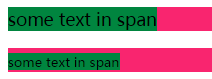
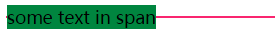
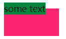

### 引言

> `CSS`中的行内非替换元素很多时候作为文本的容器出现，但是在它看似很不起眼的背后，却是受到很多`CSS`属性的约束，例如`line-height`和`vertical-align`属性。在这些属性的作用下，行内非替换元素的表现（甚至是对同级其他元素乃至对父元素的影响）有时候也值得我们好好去推敲一番。

### font-size和line-height属性的影响

我们给行内元素添加一个背景色，来看看它究竟在页面中“占据的空间”是多少：
```html
<p><span>some text in span</span></p>
<p class="bottom"><span>some text in span</span></p>
<style>
span { background: #00853F; }
p { background: #F9256F; }
.bottom span { font-size: 12px; }
</style>
```

看起来`span`元素占据的空间就是它背景色所覆盖的区域，但其实如果把`span`元素的字体大小修改为`12px`（默认情况下为`16px`）：



会发现`span`元素背景色区域（这个区域就是`span`元素的内容+`padding`占据的区域）随着字体大小变化会发生变化，但它占据的空间依然还是那么大（因为`p`元素高度并没有发生改变），这是因为行内元素的高度（占据的空间）仅仅由它本身的`line-height`属性值决定，与其他属性没有关系。

如果`p`元素中有多行文本，每一行可以看成一个个的行盒（`line box`），`p`元素最终的高度就是由这一个个行盒堆叠起来的。而每个行盒（每一行）内部又是由一个个行内元素（也可能有`inline-block`元素）形成的行内盒子（`inline box`）构成。在一行文本中，不同的行内元素有可能高度不一，最终行盒的高度取决于该行内高度最高的行内盒子的高度。接下来详细讲一讲影响行内盒子高度的`line-height`属性。

### line-height属性
`line-height`属性可以应用在行内非替换元素（以下简称行内元素）上，也可以应用在块级元素，供块级元素内部的行内元素继承。当它应用在`inline-block`元素上时不起作用（`inline-block`元素在行盒中占据的高度由内容高度 + 上下`padding` + 上下`border` + 上下`margin`构成，如果这些属性都有设置的话）。`line-height`属性值可以是普通的长度值，也可以是百分比值或纯数字（根据元素的`font-size`属性值进行计算）。
`line-height`属性有一个很重要的特点，就是垂直居中性。无论元素字体是大是小，行内元素形成的行内盒子在垂直方向上和元素背景色区域是对称的，也就是说，如果`line-height`属性指定的值超出元素背景色区域高度，则多出来的部分会平均分配到背景色区域的上下，形成行内盒子真正占据的高度，举例：

```html
<p><span>some text in span</span></p>
<style type="text/css">
p {line-height: 0; border: 1px solid #F9256F;}
span {background: #00853F;}
</style>
```

显示的结果如下：



利用这个特性可以实现单行文本的垂直居中，只需要将元素的`line-height`属性值设置为元素所需要拥有的高度即可。也是因为这个特性，会影响到元素所在父元素的高度起始位置，举例：

```html
<p class="outer"><span class="inner">some text</span></p>
<style type="text/css">
.outer { width: 100px; height: 50px; background: #F9256F; line-height: 0; }
.inner { background: #00853F; }
</style>
```

显示出来的结果如下：



### vertical-align属性
`line-height`属性影响的是行内元素所占据的高度，而与之息息相关的还有另外一个属性是`vertical-align`属性。

`vertical-align`属性可以应用在行内元素或者`td`、`th`等元素，也可以应用在`::first-letter`和`::first-line`等伪元素上。和`line-height`属性不同的是，`line-height`属性可以应用在块级父元素上以供子元素继承该属性，而`vertical-height`属性则不行。`vertical-align`属性不会改变元素的基线位置，影响的是元素中的文本在竖直方向上的位置。

```html
<p><span>x-baseline</span></p>
<style type="text/css">
p { vertical-align: middle; /*不起作用*/ }
</style>
```

`vertical-align`属性默认值为`baseline`；正常情况下在一个块级元素中包含一个`img`元素时，底部会出现间隙，这就是因为`vertical-align`属性值为`baseline`造成的。

应用在行内元素上时可以使用的值有：
`baseline`：将元素基线和父元素基线进行对齐；
`text-top`：将元素生成的行内盒子（注意不是元素背景色区域顶部）顶部与父元素的原始文本（父元素内部不经过修饰的直接文本）顶部对齐；
`text-bottom`：将元素生成的行内盒子底部与父元素的原始文本（父元素内部不经过修饰的直接文本）底部对齐；
`super`：将元素基线和父元素的上标基线对齐；
`sub`：将元素基线和父元素的下标基线对齐；
`middle`：将元素背景色区域垂直方向上的中点处与距父元素基线上方1/2 x字符的高度处对齐；

以上的属性值是根据父元素进行对齐的；关键是要确定父元素基线的位置（有一点是肯定就是父元素的基线就是父元素中原始文本的基线，而它具体的位置还受到撑起当前行盒高度的行内盒子的`vertical-align`属性值的影响），父元素基线位置的确定方法：

先找到撑起当前行盒高度的行内盒子，比较简单的情况就是找到的行内盒子的`vertical-align`属性为默认值`baseline`，如果是`baseline`，则该行内盒子的基线就是父元素的基线；如果是其他值，还需要进一步根据具体值进行分析，也就是说，撑起当前行盒高度的行内盒子的`vertical-align`属性值会影响到当前父元素的基线位置。

以下两个值则是根据行内元素当前所在的行盒进行对齐，在某个行内元素设置这两个值会影响到元素所在行所有的行内盒子也应用相同的值；
`top`：将元素生成的行内盒子（及其后代）顶部与行盒顶部对齐；
`bottom`：将元素生成的行内盒子（及其后代）底部与行盒底部对齐；
除了可以设置这些值之外，还可以设置长度值和百分比值（根据元素`line-height`属性值进行计算）。