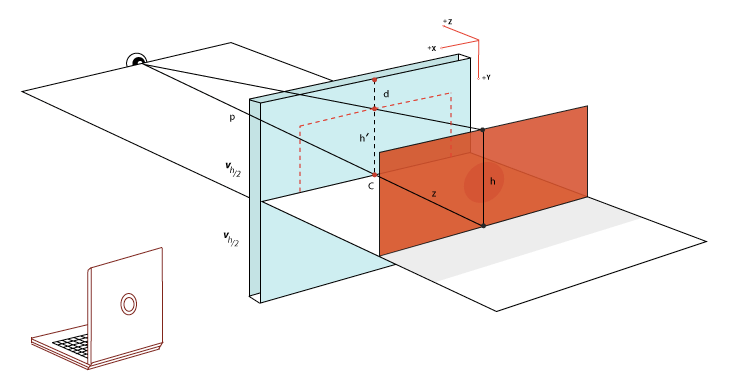

## perspective属性

使用perspective属性指定的距离就是眼睛到屏幕之间的距离，同时设置了perspective属性的元素包含的子元素如果设置了z轴负方向上的偏移（即向屏幕内偏移），该子元素最终在屏幕上会变小，即原来h的高度变成了在屏幕上的 h'。也就是说，存在以下的关系：

> p/(p+z) = h'/h



同样是滚过距离为h，在z轴负方向上发生位移的子元素实际上表现为在屏幕上滚过h’的距离，视觉上的反应就是该子元素的滚动速率要比其他元素滚动速度要慢。

有了这个基础，就可以用来实现视差滚动。视差滚动的本质就是两个元素滚动的速率不一致，造成相对运动的一种视觉效果。大致代码如下：

```html
<div class="container">
  <div class="box">
    <div class="content">
      <h1>Seaice's demo</h1>
      <p>默认情况下，EsLint 使用的解析器只能识别 ECMAScript5 代码，这意味着我们如果在代码中使用 ES6 语法，在执行 eslint 命令时就会报语法错误。因此我们还需要修改相关的解析器选项，正如上面给出的配置（上面的代码同时增加了对JSX语法的支持）。另外，还需要在 env 配置项中添加 es6 环境，以便于我们使用 ES6 新增的全局变量（例如Symbol类型等等），这样我们就可以在项目中畅快地使用 ES6 语法了。</p>
      <p>默认情况下，EsLint 使用的解析器只能识别 ECMAScript5 代码，这意味着我们如果在代码中使用 ES6 语法，在执行 eslint 命令时就会报语法错误。因此我们还需要修改相关的解析器选项，正如上面给出的配置（上面的代码同时增加了对JSX语法的支持）。另外，还需要在 env 配置项中添加 es6 环境，以便于我们使用 ES6 新增的全局变量（例如Symbol类型等等），这样我们就可以在项目中畅快地使用 ES6 语法了。</p>
    </div>
    <i class="smile"></i>
    <i class="fish"></i>
    <i class="tree"></i>
  </div>
</div>
```

```css
.container {perspective: 1px; height: 400px; overflow-x: hidden; overflow-y: auto;}
.box {transform-style: preserve-3d; position: relative; height: 800px;}
.content {position: absolute; width: 60%; top: 0; left: 50%; transform: translate3D(-50%, 120px, -1px) scale(2); background-color: gray; height: 600px; opacity: .5; box-sizing: border-box; padding: 20px;}
h1 {margin: 0;}
.smile, .fish, .tree {position: absolute; left: 50%; top: 50%; transform: translate(-50%, -50%); background-size: contain; background-position: 50% 50%; background-repeat: no-repeat;}
.smile {background-image: url(./smile.jpg); width: 100px; height: 100px; margin-top: -200px; margin-left: -400px;}
.tree {background-image: url(./tree.jpg); width: 80px; height: 80px; margin-top: 100px; margin-left: 400px;}
.fish {background-image: url(./fish.jpg); width: 180px; height: 180px; margin-top: 200px; margin-left: -500px;}
```

核心代码就是在.container 元素上设置perspective属性，参与视差滚动的元素都包含在.box元素中，同时.box元素需要设置transform-style: preserve-3d，参与视差滚动的元素均相对.box元素绝对定位。最后区别正常滚动的元素，包含主体内容的.content元素设置了transform: translate3D(-50%, 120px, -1px) scale(2)，因为在z轴负方向上设置了偏移，导致元素投影到屏幕上时尺寸缩小了，所以需要设置scale对元素进行尺寸的放大。

最终效果：