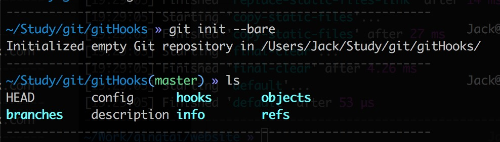

## git hook

git hook是git本身带有的功能，允许开发者在使用git的特定时机触发一些预先定义好的操作，而这些操作是通过 .git/hooks/ 目录下的自动化脚本进行定义的。要触发 git hook 的仓库和我们平时使用git init命令初始化的代码仓库是不一样的，前者需要通过 git init --bare 命令进行创建，而且执行完这一条命令之后，相当于是把一般的代码仓库中 .git 隐藏目录中的文件和目录直接存放在创建出来的仓库中。使用git init --bare创建出来的仓库目录结构如下：



然后我们的自动化脚本就放在 hooks 目录下。以自动部署代码为例，通常我们向远程仓库推送代码时，实现自动将代码部署到服务器上的这一操作，需要定义在 hooks/post-update 脚本文件中。具体操作步骤：

```bash
# 先建立裸仓库，裸仓库作为本地代码更新到服务器部署目录的桥梁，裸仓库中会保存本地推送的信息，但是不会包含具体的项目代码
$ cd /test/githooks
$ git init --bare
$ cp hooks/post-update.sample hooks/post-update
$ vi hooks/post-update
# 在post-update中定义我们在推送完代码需要触发的操作，post-update中的内容如下：
unset GIT_DIR
WWW_ROOT=/test/www/githooks

cd $WWW_ROOT
git pull
echo 'Pull successfully!'
# post-update内容结束
```

在服务器上建立项目部署目录(/test/www)：

```bash
$ cd /test/www
$ git clone ../githooks
# 此时test/www目录下多了一个新的githooks目录，每次代码更新后都会自动从/test/githooks中拉取最新的代码
```

本地推送代码

```bash
# 克隆远程仓库到本地，就是上面建立的githooks裸仓库
$ git clone root@111.22.123.123:/test/githooks
# 修改，提交并推送
$ git add .
$ git cz
$ git push
# 这是就会触发githooks裸仓库中的hooks/post-update脚本，在项目部署目录中会自动拉取最新的更改信息
```

对比travis CI，git hooks也是具有自己一定的优势，比如上面的脚本执行情况会直接反映到本地执行 git push 时打印出来的结果中，开发者可以实时了解自动化任务的执行情况。

