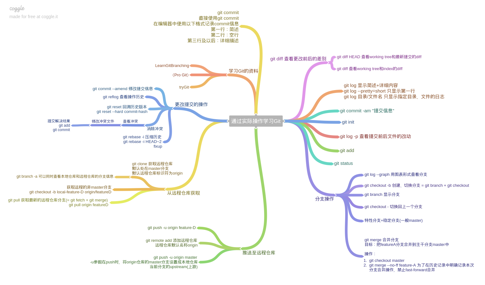

# Git简介

Git作为一个非常强大的版本控制工具，总是感觉它有很多东西需要理解清楚。但是任何一篇博客都不可能对Git所具有的功能和命令都面面俱到，也不现实。只要对Git中的一些主要概念和工作流有一定的了解，可以处理日常使用中遇到的一些常见问题即可。所以这片博客主要会总结自己在平时开发中遇到的和Git有关的问题，并且将一些常用的命令记录下来，分享给大家。

## 从新建一个git项目开始

在本地可以通过 `git init ProjectName` 快速新建一个 git 项目，新建的git项目里面会包含一个 `.git` 隐藏目录，该目录下主要保存当前项目的版本控制信息。
新建之后就可以添加文件，并提交到本地仓库：
```bash
...
git add .
git commit -m 'something you have done'
```
在将代码推送到远程仓库之前，需要先配置远程仓库信息（配置的远程仓库需要先在远程托管服务器上进行创建，注意**创建时除了仓库名称其他信息保留默认值**）：
```bash
# 配置远程仓库地址
git add remote origin RepositoryUrl
git push -u origin master
# -u选项会在远程仓库中创建master分支，并将本地仓库的master分支关联到远程仓库中的master分支
```

## Git中的撤销更改

很多时候我们需要撤销我们的提交、添加的文件修改。这时候就可以用到git reset这个命令。不删除工作空间改动代码，撤销commit，并且撤销 git add . 操作，这时可以使用：`git reset HEAD^` ，它等价于 `git reset --mixed HEAD^`

> 注：HEAD^的意思是上一个版本，也可以写成HEAD~1，HEAD通常指向当前所在分支的最新提交。在撤销提交时单独运行git reset命令不起作用，git reset命令只能撤销git add .操作

如果只想撤销commit，而不撤销git add .操作，则可以使用 `git reset --soft HEAD^` ；如果想撤销commit以及git add .操作，同时撤销所做的所有代码修改，则可以使用 `git reset --hard HEAD^`（有风险，谨慎使用！）

如果此时还没有将工作区的修改添加到暂存区（即还没有执行 git add . 操作），则可以使用`git checkout .`命令来撤销对代码所做的修改。

## git rm

git rm可以用来删除项目中的文件，同时会将此次删除操作自动添加到当前项目的版本控制历史中来。如果只是想把文件从暂存区或者已经提交的内容中移除，而不是删除文件，可以使用 `git rm --cached filePath` 来移除。

## 其他命令



