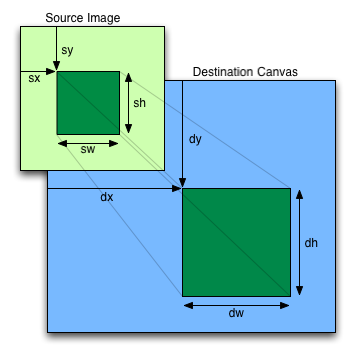

## canvas简介

canvas是HTML5中引入的一项新的绘图技术，它提供了丰富的API可以让我们在网页中绘制2D图形甚至是3D图形，另外还能够在网页中创建一些复杂的交互动画。

## API

下面就粗略地过一遍canvas提供的API，着重给出一些接口在实际使用中应该注意的问题。

### ctx.drawImage

此方法可以很方便地把现有的图片绘制到canvas元素中。具体可以传递的参数格式如下：

```javascript
drawImage(image, sx, sy, sw, sh, dx, dy, dw, dh)
```



一图胜千语呀😄