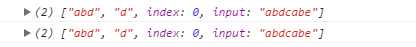
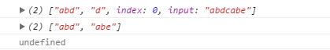

闲来无事，又重温了一遍JavaScript中的正则表达式，发现每次都能从中学到新的东西，正所谓温故而知新嘛。因此借此机会把东西都记录下来。

## 基础知识

### 创建正则表达式对象

通常创建正则表达式对象有两种方法，一种是通过对象字面量的形式，一种则是通过构造函数的方式。使用对象字面量进行创建的形式如下：

```javascript
var expression = / pattern / flags;
```

通常可以指定的标志flags有以下这些：

"g"：表示全局模式，即模式将在字符串上一次匹配到子串的位置之后开始匹配，而不是每次都从头开始进行匹配。

"i"：表示不区分大小写模式。

"m"：表示多行模式，即到达一行文本末尾时还会继续查找下一行中是否存在与模式匹配的子串。

另外一种创建方式就是通过RegExp这个构造函数，该函数接受两个参数，分别是模式pattern和标志flags：

```javascript
var expression = new RegExp(pattern, flags);
```

模式pattern中会包含一些元字符，在对一些元字符进行转义的时候要使用“\”进行转义。对于这两种创建的方式，转义的方式略微有所不同，前者（使用对象字面量进行创建的方式）只需要直接使用“\”进行转义即可，而后者（使用构造函数创建的方式）则需要双重转义（也就是说，还需要对“\”进行转义。要使用“\\”代替原来模式pattern中的“\”）。

正则表达式中的反斜杠有两个作用，一种是和常规字符一起使用，用来表示一个特殊字符，比如'\s'表示一个空白字符；另一种则是和正则表达式中的元字符一起使用，对元字符转义成普通字符，例如'\+'表示一个普通的加号。

关于使用全局模式"g"和不使用全局模式"g"的区别，可以看下面的例子：

```javascript
var reg = /abc/g;
for (var i = 0; i < 4; i++) {
    console.log(reg.test("abcbc")); // true false true false
}
```

在上面的例子中，由于使用了全局模式，则在每一次匹配到子串之后，下一次匹配的时候会从上一次匹配到的子串位置之后开始匹配。当第一次调用test方法匹配成功之后返回true，第二次调用test方法的时候会从abc后面的bc开始匹配，发现匹配失败，结果就返回false；第三次在前一次已经匹配失败的情况下，又从头开始匹配，如果往复，最终打印出来的结果就是true和false交替出现。而如果没有使用全局模式，则每次匹配的时候都是从头开始匹配，因此打印出来的结果都是true。

## 正则表达式中的元字符

正则表达式中核心的部分就是掌握各种元字符的作用。下面就来讨论一些常用的元字符吧。

### “+”元字符

匹配前一个表达式一次或多次。

### “*”元字符

匹配前一个表达式零次或多次。

### “(x)”元字符

匹配x并在后续匹配过程中会记住此项，在一些后续匹配需要用到之前匹配到的内容时会有用。举个例子，给定字符串"abcd bcd"，使用正则/(bcd)\s\1/就会匹配字符串中的"bcd bcd"。定义好捕获组之后，在后面就可以使用类似“\”+数字的形式来引用捕获组匹配到的内容。另外，在使用replace(/(x)/, s)方法替换字符串中的内容时参数s也可以通过使用类似“$”+数字的方式来引用第一个参数中捕获组匹配到的内容。

### “？”元字符

常用于匹配前一个表达式零次或者一次。但是“？”还有其他的应用场景。比如说，默认情况下，正则表达式默认会使用贪婪模式进行匹配，即每次匹配时诸如“+”、“*”、“？”、“{}”这些元字符会尽可能多地匹配字符。而如果在这些元字符后面加上“？”元字符，则这些元字符会使用非贪婪的模式进行匹配。

另外，“？”还会用在诸如“(?:x)”表示匹配x但不记住此项，意味着在后续的表达式中就不能通过“\”+数字的方式来引用该捕获组匹配到的内容。

### “^”元字符

匹配给定字符串的开始位置，注意不是字符串中每一行的行首位置。

### “$”元字符

匹配给定字符串的结束位置。

### “x|y”

匹配x或者y。

### “{n}”和“{n, m}”

“{n}”用于刚好匹配在它之前的表达式n次。“{n, m}”则匹配在它之前的表达式至少n次，最多m次。

<i>* 2018年2月25日补充：</i><i>如果要匹配前面的字符至少n次，可以这样写：{n, }，注意中间的逗号不能省略，当n=1时，等价于元字符“+”。</i>

### “[xyz]”

列出一些匹配的字符，此表达式只匹配单个字符。“[]”中可以包含任意字符，包含转义字符，还可以使用破折号（-）来指定一个字符范围。对于点（.）和星号（*）这样的特殊符号在一个字符集中没有特殊的意义，因此不需要进行转义，当然也可以进行转义。

举例，/[a-z.]+/ 和/[\w.]+/都匹配“test.i.ng”中的所有字符。

### “[^xyz]”

匹配除“[xyz]”之外的任意单个字符。

### “.”

匹配任意单个字符。

### 其他一些特殊的转义字符

在正则表达式除了可以使用上面提到的这些元字符之外，还可以使用一些转义字符：

“\b”：匹配一个单词的边界，它不匹配任何字符，只是单纯表示一个单词的边界。

“\B”：匹配一个非单词边界，需要注意的一点是，一个字符串的开始和结尾都被认为是非单词边界。

“\d”：匹配任意单个数字，等价于[0-9]。

“\D”：匹配任意单个非数字的字符。

“\s”：匹配任意单个空白字符，包括空格、制表符、换页符（"\f"）和换行符。

“\S”：匹配任意单个非空白字符。

“\w”：匹配单个数字、字母或下划线字符，相当于[0-9a-zA-Z_]。

“\W”：匹配“\w”之外的其他任意单个字符。

## RegExp对象实例属性和方法

RegExp对象实例具有这些常用属性：

"global"：布尔值，表示是否设置了全局模式。

"ignoreCase"：布尔值，表示是否设置了"i"标志。

"lastIndex"：表示搜索下一个匹配项时开始的字符位置。

"mulitiple"：布尔值，表示是否设置了多行模式。

"source"：正则表达式的字符串表示，按照对象字面量的形式而非传入RegExp构造函数的字符串形式。

同时，RegExp对象实例还具有以下这些常用方法：

RegExp.prototype.exec(string) 该方法返回一个包含**第一个匹配项**的数组，或者在没有匹配项的情况下返回null。返回的数组对象还具有两个额外的属性，分别是index和input属性，index属性表示匹配到的子串在原字符串中的位置，而input属性则表示传入到match方法中的字符串。 返回的数组格式：第一项是整个模式匹配到的子串，其他项是与模式中包含的每个捕获组匹配到的子串。

在设置全局模式的情况下，每次调用exec方法都会上一次匹配到子串的位置之后继续搜索新的匹配项。而如果没有设置全局模式，每次都是从头开始匹配字符串，每次都会重置RegExp对象的"lastIndex"属性。

_2017年6月9日补充：_

egExp.prototype.exec和String.prototype.match方法得到的结果不完全一样。在不设置全局匹配标志时两者可以得到一致的结果。而在设置了全局标志之后，前者返回值保持不变，依然只返回一个匹配项以及捕获组的匹配情况；而**后者则一次性返回所有的匹配项，但不会包含捕获组的匹配信息。举例：

没有设置g标志位的情况：

```javascript
var reg = /ab(d|e)/;
console.log(reg.exec("abdcabe"));
console.log("abdcabe".match(reg));
```

浏览器控制台打印出来的结果：



设置g标志位的情况：

```javascript
var reg = /ab(d|e)/g,
    result = "abdcabe".match(reg);
console.log(reg.exec("abdcabe"));
console.log(result);
console.log(result.input);
```

浏览器控制台打印出来的结果：



RegExp.prototype.test(string) 该方法在给定字符串中存在与模式匹配的子串的时候返回true，反之返回false。同样是否设置全局模式对该方法的行为也会有所影响。