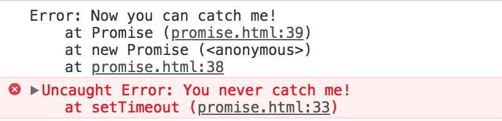

## Promise使用注意事项

每个Promise对象都只能转化为Resolved状态，或者是Rejected状态，且一旦状态确定就不可修改。创建Promise对象最基本的方法就是通过向Promise构造函数传入一个函数，在此函数中可以直接执行一些异步操作，然后在异步操作完成或者失败时分别调用函数传入的resolve和reject函数来通知Promise对象状态进行更改。需要注意的一点是，调用resolve函数并不意味着Promise对象就一定转化为Resolved状态（比如向resolve函数传入一个新的Promise对象B，则前面的Promise对象的最终状态由Promise对象B的最终状态决定；传入其他值则会将原来的Promise对象转化为Resolved状态），但是调用reject函数确是会将Promise对象修改为Rejected状态。

```javascript
  let p1 = new Promise((resolve, reject) => {
    resolve(new Promise((rs, rj) => {
      rj(new Error('error'))
    }))
  })
  p1.then(() => {
    console.log('resolved')
  }).catch(err => {
    console.log('rejected')
  }) // 'rejected'

  let p1 = new Promise((resolve, reject) => {
    resolve(new Error('error'))
  })
  p1.then(() => {
    console.log('resolved')
  }).catch(err => {
    console.log('rejected')
  }) // 'resolved'
```

在Promise函数体中抛出的错误，可以被Promise对象后续调用的catch方法所捕获。如果没有使用catch方法进行捕获，在Promise函数体中抛出的错误也不会传递到外层代码。而在Promise对象包含的异步操作中抛出的错误则会直接传递到外层代码，而且catch方法也无法捕获。举例：

```javascript
  new Promise(resolve => {
    setTimeout(() => {
      throw new Error('You never catch me!')
    })
  }).catch(err => {
    console.log(err)
  })
  new Promise((resolve) => {
    throw new Error('Now you can catch me!')
  }).catch(err => {
    console.log(err)
  })
```

