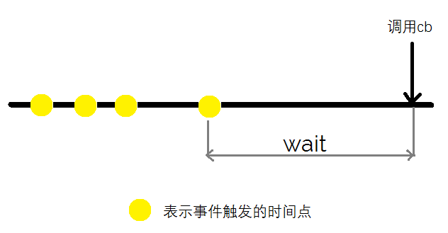
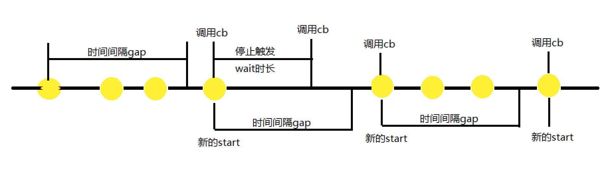

## 函数对象常用方法

### bind方法

bind方法可以用来固定函数A中的this指向。除了可以传入一个对象作为第一个参数之外，bind方法还可以接收额外的参数(不定个数)，通过函数A的形参可以拿到传入的这些参数值。举例：

```javascript
let ff = function (name, word) {
  console.log(name)
  console.log(word)
}
let bindFF = ff.bind(this, 'Jack')
bindFF('hello') // 'Jack' 'hello'
```

## 函数式编程

### 偏函数

对原始函数预设部分参数并返回一个新的函数。举例：

```javascript
const partical = (f, ...args) => (...moreArgs) => f(...args, ...moreArgs)
const add3 = (a, b, c) => a + b + c
let fivePlus = partical(add3, 2, 3)
fivePlus(4) // 9
```

偏函数也可以通过函数对象的bind方法来实现。

### 柯里化

柯里化是将某个需要接收多个参数的函数转化为执行一系列函数，每个函数只接收一个参数。柯里化的作用在于可以提高参数的复用（偏函数也有类似的作用）。举例：

```javascript
let prop = curry((key, obj) => obj[key])
```

prop('name')返回的函数A相当于是内部的key值固定为"name"，以后只需要向A函数传入某个对象就可以直接获取该对象的name属性值。curry函数实现和偏函数实现方式类似。

总结：偏函数和柯里化实现方式大同小异，两者最明显的区别在于：
偏函数是将原始函数转化为一个n-x元的一个函数，其中原始函数的x个参数的值已经被固定了；
柯里化则将原始函数转化为n个一元函数。

### 防抖、节流

防抖（Debounce）的定义：在用户频繁触发事件的时候只在停止触发的某段时间之后才去真正触发。防抖的概念来自于硬件电路，当机械按键在按下时开关会在接触时会反复地开合多次（抖动），这时候为了去抖，我们会只在停止触发一段时间之后才去处理，而中间频繁（触发时间间隔较小）的触发都会被跳过而不被处理。图示以及代码实现：



```javascript
function debounce(cb, wait) {
  var timeout;
  return function() {
    var context = this, args = arguments;
    if(timeout) clearTimeout(timeout);
    timeout = setTimeout(function() {
      cb.apply(context, args);
    }, wait);
  };
}
```

防抖的问题在于如果事件一直触发，而且前后两次事件触发的时间间隔始终小于所设置的wait时长，则会导致事件处理函数始终不会被调用。因此在此基础上再加上节流的思想会更好一些，保证处理函数在规定的时间内执行一次。

节流（Throttle）的定义：设置固定的函数执行速率，在用户频繁触发事件的时候只允许处理函数在规定的时间内执行一次，图示以及代码实现：



```javascript
function throttle (cb, wait, gap) {
  let start, timer
  return () => {
    let args = arguments
    let now = Date.now()

    if (!start) {
      start = now
    }

    clearTimeout(timer)
    if (now - start <= gap) {
      cb.apply(null, args)
      start = now
    } else {
      timer = setTimeout(() => {
        cb(...args)
      }, wait)
    }
  }
}
```