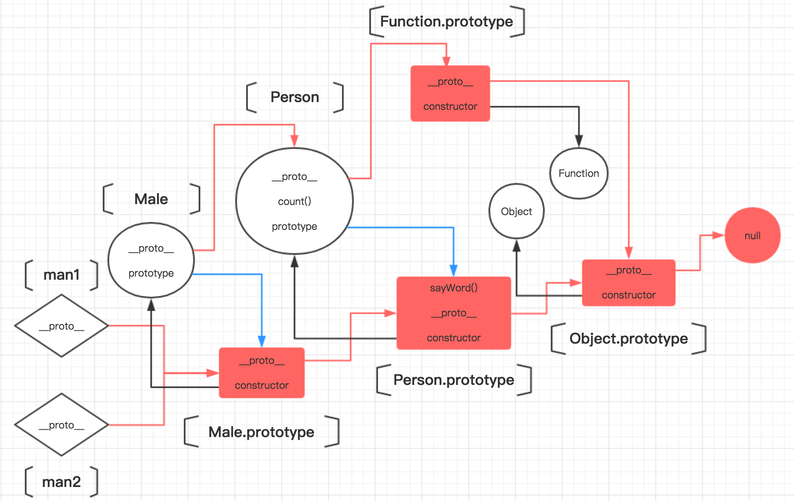

> ES2015标准中提出了另外一种可以用来定义类的方法，那就是通过class语法来定义。以前我们都是通过构造函数来创建实例。而如今，我们可以选择这种更加贴近其他面向对象语言的类的定义方式。

## 基础语法
```javascript
    class A {}
```
以上的代码就简单地定义了一个类。对于这样的类，可以采用我们熟悉的方式来创建实例：
```javascript
    var a = new A();
```
这是最简单的定义方式了。我们还可以尝试向类中定义初始化代码，这部分代码会在创建实例时被调用。举例：
```javascript
    class A {
        constructor () {
            this.word = "hello, class!";
        }
    }
```
而这部分代码类似于我们以前定义在构造函数中的代码，两者作用都是相同的。其中this指向我们新创建的实例。除此之外，我们以前还会把所有实例共享的方法和属性都定义到原型对象上。而通过class语法也可以很轻易地做到这一点：
```javascript
    class A {
        constructor () {
            this.word = "hello, class!";
        }
        sayWord () {
            console.log(this.word);
        }
    }
    var a = new A();
    a.sayWord(); // "hello, class!"
```
综上所述，我们可以把所有实例的共性通过上面的方式定义到原型对象上，而把每个实例的个性定义在consturctor的对象初始化代码中。另外，我们还可以在class语法中定义类的静态方法。具体做法是在原型对象方法之前加上“static”关键字：
```javascript
    class A {
        static sayHello() {
            console.log("hello");
        }
    }
```
定义的类的静态方法只能是在类本身进行调用，如果在实例上调用这些方法，则会报错。例如：
```javascript
    A.sayHello(); // "hello"
    var a = new A();
    a.sayHello(); // Uncaught TypeError: a.sayHello is not a function
```
此外，类的静态属性的正确定义姿势：
```javascript
    class A {}
    A.prop = "class A's prop";
```
_2018.01.23补充：_
_有时候我们在其他代码可能会见到以下这种在类中定义变量的写法（ES6中不支持这两种定义方式）：_
```javascript
// 在下面的示例代码中，通过这种方式定义的info属性会在实例化时会定义到每个新创建的实例上
// 通过static关键字定义静态属性的做法在ES 6中也暂不支持（包括下面的info属性的定义方式）
// 但是可以通过babel-preset-stage-0这个插件进行转化
class Animal {
    static sss = 'A static property'
    info={
        name: "Mary"
    }
}
```
## 实现继承的方式
以前我们实现继承最惯用的手法就是通过将子类的原型对象赋值为父类的实例来实现的。而ES6中提供了实现继承的更加简洁的书写方式，引入了extends关键字。
```javascript
    class Person {}
    class Male extends Person {}
```
这里所说的继承包含两层含义，一方面，子类的原型由父类的实例充当，由此构成原型链。子类实例继承父类实例的属性和方法，在不重写父类实例的属性和方法的前提下，子类实例通过原型链可以访问到父类实例中的属性和方法。另一方面，子类继承父类的静态方法。举例：
```javascript
    class Person {
        speak(word) {
            console.log(word);
        }
    }
    class Male extends Person {
        constructor() {
            super();
        }
    }
    var man = new Male();
    man.speak("Hello!"); // "Hello!"
```
需要注意的是，子类构造函数中可以通过super关键字来显式调用父类的构造函数。而在调用父类的构造函数之前，子类构造函数中不能访问this这个变量。例如：
```javascript
    class Person {}
    class Male extends Person {
        constructor() {
            this.name = "Jack";
        }
    }
    var man = new Male(); // Uncaught ReferenceError: Must call super constructor in derived class before accessing 'this' or returning from derived constructor
```
关于继承，使用extends一方面会使得子类继承父类的静态方法。举例：
```javascript
    class Person {
        static count() {
            console.log("Millions");
        }
    }
    class Male extends Person {}
    Male.count("Hello!"); // "Millions!"
    console.log(Male.__proto__ === Person); // true
    console.log(Person.__proto__ === Function.prototype); // true
```
另一方面，子类实例可以通过原型链访问到父类实例的属性和方法（继承）。举例：
```javascript
    class Person {
        sayWord(word) {
            console.log(word);
        }
    }
    class Male extends Person {}
    var man1 = new Male();
    var man2 = new Male();
    man1.sayWord("Hello!"); // "Hello!"
```
子类、父类及其实例的关系可以用下面这张图进行描述：



从上面的这张图也可以看出，定义的类本质上就是函数，而且通过extends关键字在类与类之间构造出了类似原型链的连接，通过这种连接实现了父类与子类静态方法的继承。而这是在以往我们使用的传统的继承手段中所没有的。

## class语法中的super关键字

最后，我想谈谈class语法中的super关键字，这个关键字本身有很多特别之处。比如说：

- 在子类构造函数中使用this变量之前，必须显式调用super来先构造父类实例，然后再在子类构造函数中进行初始化，构成最终的子类实例。(注意构造出来的父类实例和最终的子类实例是同一个对象实例)
- super使用时有固定的格式，不能把它当作普通的变量。
- ...

super可以用来在子类中调用父类的构造函数、父类的方法（包括静态方法和原型对象上的方法）。
```javascript
    class Person {
        constructor() {
            console.log("Init");
        }
        static say() {
            console.log("Jack");
        }
        speak() {
            console.log("Harrison");
        }
    }
    class Male extends Person {
        constructor() {
            super();
        }
        static saySomething() {
            super.say();
        }
        static speakSomething() {
            super.speak();
        }
        sayWord() {
            super.say();
        }
        speakWord() {
            super.speak();
        }
    }
    Male.saySomething(); // "Jack"
    Male.speakSomething(); // Uncaught TypeError: (intermediate value).speak is not a function
    var man = new Male(); // "Init"
    man.sayWord(); // Uncaught TypeError: (intermediate value).sayName is not a function
    man.speakWord(); // "Harrison"
```
从上面的例子可以看出，super用在子类中不同的位置上时，所表示的含义也是有所不同。当在子类构造函数中调用super时，super代表的是父类的构造函数。而当在子类的静态方法中调用super时，通过super.prop可以访问到父类对应的静态方法。在子类的原型方法上调用super时，通过super.prop可以访问到父类对应的原型方法。