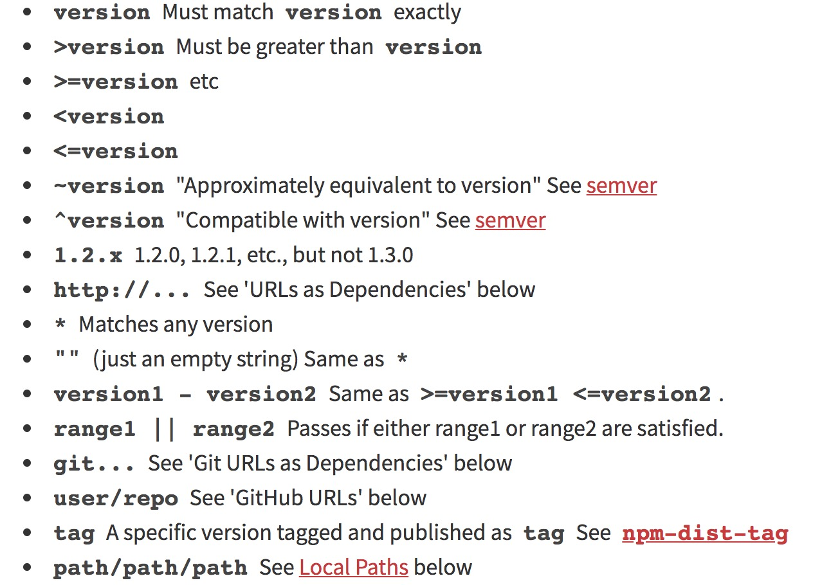

## package.json文件基本组成

### main字段

main字段用来指定当前依赖的入口文件的路径。

### bin字段

bin字段值是一个对象，对象属性名为当前package提供的cli命令名称，而属性值则是该cli命令所关联的文件。其他项目在安装了当前这个package之后，当执行package.json文件中定义的使用了这些命令的script时就会执行命令关联的文件。

其他用户在安装当前这个package时，npm会自动在node_modules目录下的.bin隐藏目录下生成关联到指定文件的软链接。bin字段中的对象属性值必须是有效的文件路径，否则用户在安装使用时就会报无法生成软链接的错误。

当我们执行npm scripts时，就等价于执行npm scripts对应的cli命令。而系统之所以能够找到这个cli可执行文件的位置，就是因为node_modules目录下的.bin目录在此之前会被添加到系统环境变量中。这一点可以在可执行文件中打印当前系统环境变量（比如借助node提供的process.env属性）得到验证。

有意思的是，在开发npm模块时，我们如果要在本地测试我们的模块及其提供的cli工具能否按我们预期的那样正常工作，可以使用在当前模块的根目录下执行`npm link`命令将当前模块放到npm package全局安装目录下，这样我们就可以直接在本地测试模块的功能，而不需要每次都经历写完功能代码然后修改模块版本号，再发布到npm上下载下来再进行测试这样繁琐的流程了。而当我们完成模块开发，就可以使用`npm unlink`命令从全局移除我们的模块了。想想npm还真是贴心❤️

### 依赖相关字段

常见的依赖相关字段包括 `devDependencies`, `dependencies`。其中会指定需要的 package 及其版本信息。

package version的指定形式有如下几种：

<i>截图来源：<a href="https://docs.npmjs.com/files/package.json#dependencies">npm 官方文档</a></i>

## node_modules目录下的.bin目录

众所周知，npm 会将项目的依赖安装到node_modules目录下，而与此同时，安装的依赖本身提供的一些cli工具则会放到node_modules目录下的.bin目录中，这样我们就可以在package.json文件中的scripts字段下直接使用这些cli命令。注意在当前项目的命令行中是无法直接使用这些cli命令的。

npx package可以帮助我们直接在命令行中使用当前项目已经安装过的命令，也就是node_modules中的.bin子目录下存放的命令行工具。直接在npx命令之后加上我们需要执行的命令即可。

## package-lock.json的由来

我们都知道，行业内推崇使用semver来管理npm package的版本，也就是说我们在项目中安装的package都应该遵循semver语义化版本。虽然semver可以保证同一份代码安装的package不会出现major版本的不同，但是在不同的安装环境中仍然还是存在差异。为了确定可以正确运行的package版本，npm从5.0版本开始推出了package-lock.json这个东西，它主要负责记录当前项目中安装的package的具体版本信息，而且官方也建议将此文件提交到代码库中，确保团队成员使用的package版本一致性。

