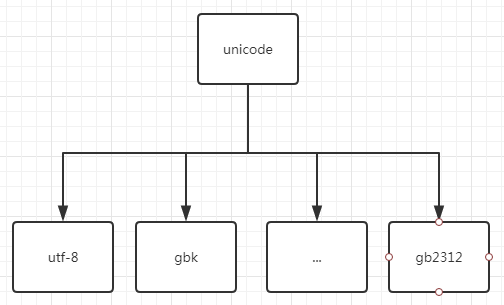
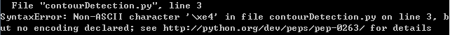
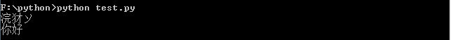

> 我们在使用python时经常会遇到一些字符编码问题，经常会遇到各种各样的困惑。归根到底还是python2和python3中基本字符串类型以及编码转换时默认使用的编码方式发生了变化。

还是先从一些基本的内容讲起。

## unicode

`unicode`也称万国码，它规定了使用两个字节来表示每个字符。我们都知道，`ascii`中定义了128个字符的编码方式，也就是只是用一个字节来表示一个基本字符。试想如果使用`unicode`编码直接来表示所有字符，这意味着现在存储那些仅包含基本字符的文本文件需要比原来整整多出一倍的空间。这对于我们很多人来说是不能接受的。于是就出现了各种可变长的编码方式。

虽然说`unicode`也是一种编码方式，但是它和我们熟知的`utf-8`等等各种编码方式还是有本质区别的。`unicode`仅仅只是为人类语言中出现的每个字符指定了一个码位，真正保存在计算机底层中的是经过`utf-8`等其他编码方式编码后的结果。不同编码之间的转换还需要通过`unicode`这个中间层来过渡，从`unicode`到其他编码方式之间的转换就是一次`encode`的过程，而逆过程就是`decode`。



## python中的字符编码转换

### 读取文件

这里有必要提一下咱们在`python`中可能遇到的那些和字符编码有关的场景以及它们具体代表的含义。首先是文件开头可能会出现的`encoding`声明：
```python
#-*- coding:utf-8 -*-
```
上面的这行注释，主要是用于告诉`python`解释器当前在执行这个脚本之前要使用哪一种编码方式来读取并解析当前这个文件。我们都知道，我们的文件是以某种编码方式保存到硬盘中的，这种编码方式可以在当前我们正在操作这个文件的应用程序中进行设置。当文件保存时使用的编码方式和`python`解析文件时默认使用的编码方式不一致时，就有必要使用这行注释声明文件是以哪一种编码方式进行保存的，否则`python`在读取文件时就会报语法错误。

需要指出的一点是，`python2`中默认使用`ascii`来解析要执行的文件，而`python3`则是`utf-8`。所以在`python2`中，当我们的文件中出现非`ascii`字符而文件没有相关的声明，就会报错：



### 字符编码转换默认编码

在介绍字符编码转换之前，先说说python2和python3基本字符串之间的差异。**在python2中，我们在程序中所使用的字符串本身都应该看成是经过utf-8编码后的结果**。在直接打印字符串的时候需要考虑到控制台使用的字符集，如果控制台不是使用utf-8编码方式，则打印结果会出现乱码。比如有一段这样的python2代码：
```python
#-*- coding:utf-8 -*-
string = '你好'
print(string) # 乱码
print(string.decode('utf-8').encode('gbk'))
```
结果在windows自带的命令行（默认使用gbk）中的运行结果如下：



而在python3中使用的字符串本身就是unicode类型。这也就是python3中字符串没有decode方法的原因。同样是上面这个例子，在python3中只需要调用字符串的encode方法：
```python
print(string.encode('utf-8')) # '你好'
```
其实在python3中，对于上面这一行代码还可以继续简化：
```python
print(string.encode()) # '你好'
```
而要回答为什么可以这样做，就需要引出另外一个话题，字符编码转换时使用的默认编码方式，也就是在调用decode方法或者encode方法时不传入参数时默认使用的值。而这个值我们可以通过下面的代码来获取：

```python
import sys
print(sys.getdefaultencoding())
# 获取当字符编码转换时使用的默认编码方式
```
在python2中上面得到的结果是'ascii'，而python3中的结果则是'utf-8'。

综上所述，只要保证输出的字符串使用的编码方式和控制台使用的字符集保持一致，就能够避免乱码问题。而要将字符串转化为使用特定的编码方式，在python2中就需要先明确字符串所使用的编码方式（如果是在程序中动态创建的字符串就是utf-8编码），然后使用该编码方式进行解码，再编码；而python3中可以直接进行编码，需要指出的是，python3中unicode类型经过编码之后会得到二进制类型。

对于从其他来源（比如文件）获取到的字符串，在python3中只要在调用open函数打开时指定encoding参数为打开的文件使用的编码方式，我们读取到的字符串就已经是经过python自动解码处理了，也就是unicode类型。

而在python2中由于open函数并没有提供encoding这个参数，因此读取到的字符串的编码格式和读取的文件所使用的编码方式是一样的。比如下面这个例子将gbk编码的内容转化为使用utf-8编码：
```python
with open('./text.txt', 'r') as f:
    with open('./write.txt', 'w') as w:
        for line in f:
            w.write(line.decode('gbk').encode('utf-8'))
# 其中text.txt使用的是gbk编码，而write.txt则为utf-8编码
```