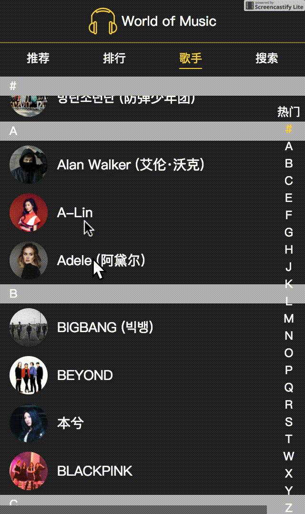
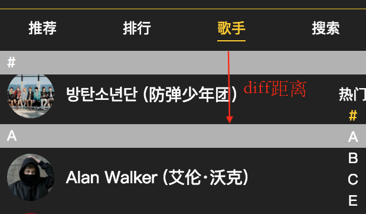
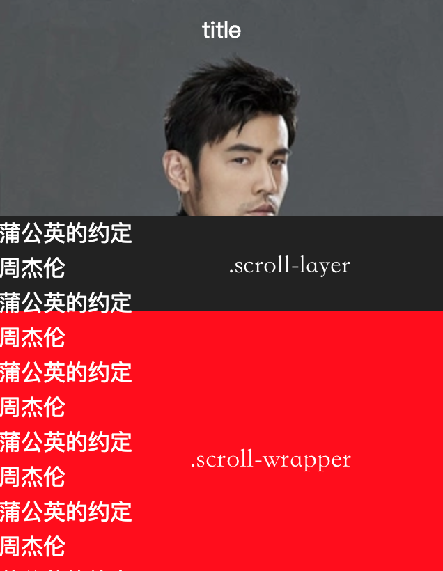

最近在一个项目中遇到以下的这样一个组件。

对于这个组件，CSS也提供了position属性来实现这种效果，需要将position设置为sticky。但我在项目中并没有使用这种方式，而主要是通过javascript来实现，这里主要记录后一种实现方法。

## sticky组件的思路

其实也没有想象中那么复杂，只需要在列表容器的顶部固定一个额外的title，然后在列表的滚动过程中检测diff距离小于title高度时动态设置title的平移距离，由此造成新的title在滚动到顶部时将上一个title向上顶的视觉效果。还是上图吧：

当检测到diff距离小于固定的title高度时，需要动态设置title向上平移（title高度-diff）的距离。需要特别注意的是，在diff距离大于title高度时，需要设置title的transform属性对应的translateY子属性为0，也就是说在其他时候title都是固定在列表的顶部的。

上面只是讲到列表向下滚动的情况，当列表向上滚动时，需要切换title时，上面的处理方式也会使得新的title从顶部慢慢露出，符合我们预期的效果。

## 图文列表组件的实现思路

下面要说的组件在我们使用一些APP的时候会见到，先上实际的效果图：

首先对上面这个组件的行为进行分解。当列表向上滚动时，列表所在的区域会被拉伸，直到触碰到顶部的header。在触碰到header之后，列表的滚动区域就是整个屏幕区域（除掉header区域）。而如果一开始列表是向下拖拽的，那么位于列表上方的图片会相应放大，给人以生动逼真的视觉体验。

这里先给出最终的代码：

<iframe height='542' scrolling='no' title='scroll-list-view' src='//codepen.io/hbChou/embed/ayKdLx/?height=542&theme-id=0&default-tab=html,result&embed-version=2' frameborder='no' allowtransparency='true' allowfullscreen='true' style='width: 100%;'>See the Pen <a href='https://codepen.io/hbChou/pen/ayKdLx/'>scroll-list-view</a> by hbChou (<a href='https://codepen.io/hbChou'>@hbChou</a>) on <a href='https://codepen.io'>CodePen</a>.
</iframe>

而对于列表滚动，这里用到了一个基于iScroll的库[better-scroll](https://github.com/ustbhuangyi/better-scroll)，可以创造出如丝般顺滑的滚动体验，墙裂安利：）better-scroll的使用也很简单，可以参照[官方文档](https://ustbhuangyi.github.io/better-scroll/doc/)。

实现思路大致是这样的：在列表滚动的过程中，我们监听better-scroll派发的scroll事件，在事件处理函数中我们可以获取到当前列表滚动过的距离。当列表向下（或向上）滚动时，我们需要动态设置.scroll-layer元素向上（或向下）平移相同的距离。为了让列表中的内容溢出进而跟随.scroll-layer元素进行滚动，因此刻意在.scroll-wrapper元素上没有设置overflow: hidden。

当.scroll-layer元素触碰到header元素底部时，再继续向下滚动，会导致列表中的内容溢出.scroll-layer元素所在的区域。这时的做法是想办法把.image元素的z-index值增大，从而盖住溢出的列表内容。但是单纯只是增大.image元素z-index并不能解决问题（这样同时会盖住.scroll-layer元素）。而实际上，只需要盖住从.scroll-layer溢出的内容即可，因此再将.image元素区域的高度缩小为header元素的高度就可以了。

如果一开始向下拖拽列表，则.image元素需要根据拖拽的距离放大同样的比例，另外，.image元素还需要设置transform-origin: top属性，才能保证在拖拽的过程中，.image元素的底部始终和.scroll-layer元素的顶部粘在一起。

