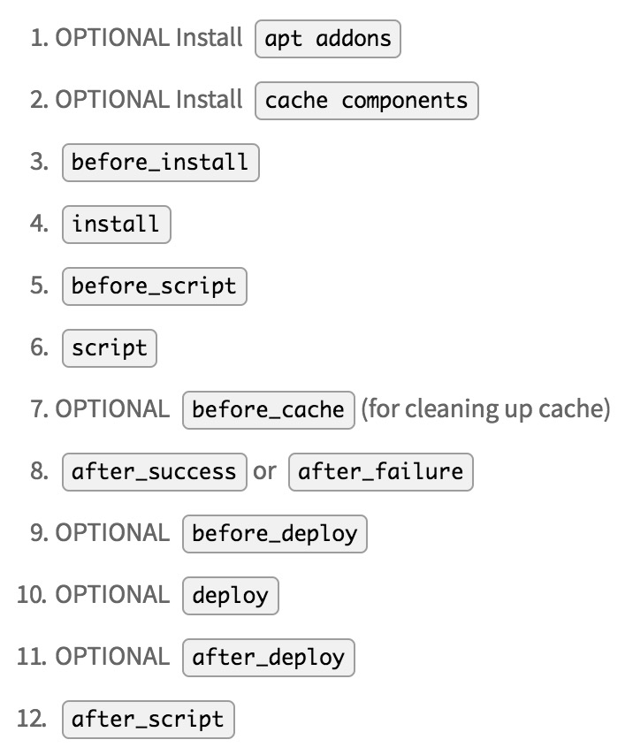

## travis CI简介

travis CI是一项广受欢迎的持续集成服务，通过这项技术，我们每次在向代码托管平台push我们的代码时，travis就可以自动帮我们完成一系列任务，比如自动将代码部署到我们的服务器，测试等等。而这一系列任务则需要我们在项目主目录下通过 `.travis.yml` 文件进行配置。

travis CI的工作原理也不复杂，它使用了代码托管平台比如 `github` 提供的 `webhooks API` ，当我们在代码库执行某些操作（比如将我们的代码push到远程仓库）时，就会触发 travis 进行自动化任务的动作。而具体完成什么任务，则要根据我们的需要通过配置文件进行配置。

需要注意的是，travis 执行自动化任务并不是在我们本地，也不是在我们的目标服务器上，而是在 travis 控制台（可以理解为在 travis 平台上搭建的虚拟环境）中。它会根据我们项目使用的编程语言灵活搭建所需要的构建环境。

下面我们就直接上一个travis的实际使用案例：

### 自动部署代码

像我们每次写完代码，将代码部署到远程服务器，重新打包我们的应用再重启服务器这样的体力活完全可以交给我们的主角 ——— `travis CI` 来完成。

travis 根据我们项目所使用的语言不同，所执行的任务也会有所不同，比如在 `JavaScript` 项目中，一般会先安装我们项目中以及构建过程中所需要的依赖，然后执行 `npm test` 测试命令（执行 `npm test` 命令是在不定义 `script` 参数时的默认行为，我们也可以根据实际情况将 `script` 参数定义为需要执行的命令集合），在命令执行成功之后我们还可以继续进行其他的操作，比如把代码部署到目标服务器。以上就是一次 build 过程会完成的内容。

我们的配置文件就是定义在依赖安装前后，脚本执行成功(或失败)之后等等一些时间节点需要 travis 帮我们自动完成的工作。完整的 `travis CI` 构建过程包含以下这几个阶段：



<p style="text-align: center;color: #ccc;"><i>截图来源：travis CI官方文档</i></p>

以 JavaScript 项目为例，按照官网的提示，首先需要在官网上对我们要 build 的 github 项目启用持续集成，接着就可以在项目主目录下添加一个名为 `.travis.yml` 的配置文件，在里面可以定义我们每次将本地代码 push 到远程仓库时build所要完成的操作。例如：

```yaml
language: node_js
node_js:
- 6.10.23
after_success:
- ssh xxx@123.123.123.123 -o stricthostkeychecking=no 'cd /projectMain && git pull && npm run build'
```

上面的配置文件指定我们项目在 travis 控制台中 build 所需要的构建环境，并且在 travis 执行测试成功之后连接远程服务器，到服务器上的/projectMain目录拉取最新代码并打包。ssh命令可以通过选项 `-o stricthostkeychecking=no` 来跳过对远程服务器返回的 public_key 的检查。

#### sshpass实现travis登录服务器

在上面的配置中，travis控制台还需要我们手动输入登录服务器的密码，但是我们并不能和travis控制台进行交互，而且ssh命令也没有提供一个选项可以用来指定登录密码。这时我们有两种方式可供选择：

1. 使用 `sshpass` 传递服务器登录密码
2. travis 控制台通过 ssh 私钥文件实现免密连接服务器

首先介绍使用 `sshpass` 这种方式。sshpass可以从特定的环境变量 `SSHPASS` 中获取到登录时所需要的密码（使用时需要加上 `-e` 选项表示从环境变量中读取）。这时候我们的配置文件就变成这样子：

```yaml
language: node_js
addons:
  apt:
    packages:
    - sshpass
node_js:
- 6.10.23
after_success:
- export SSHPASS=[your password here]
- sshpass -e ssh xxx@123.123.123.123 -o stricthostkeychecking=no 'cd /projectMain && git pull && npm run build'
```

但是这样还有一个问题，就是我们把项目公开出去之后也就暴露了我们的服务器账号和密码，这是相当危险的。travis 也替咱们考虑到了这点，为此也提供了一个用于加密键值对的工具。我们可以通过以下命令进行安装：

```bash
$ gem install travis
# 在第一次使用此命令时需要登录
$ travis login
```

然后我们就可以对我们不想公开的内容进行加密了，比如：

```bash
# 添加 --add 选项可以将加密之后的结果直接添加到.travis.yml文件中
$ travis encrypt DEPLOY_PASS=[your password here] --add
```

然后我们在配置文件中就可以使用前面定义好的 `$DEPLOY_PASS` 变量来替换掉我们前面在配置文件中使用的明文密码。至此，我们就完成每次push代码时，travis都会自动登录远程服务器，并更新服务器上的代码。

#### 加密私钥文件

除了可以使用sshpass这种方式来传递服务器登录密码之外，另外一种可以采用类似我们平时使用ssh私钥文件来实现免密登录远程服务器的方式，让travis拥有服务器ssh私钥文件来免密登录到我们的服务器上。

首先我们需要在本地的系统中生成一对用于ssh连接的非对称密钥，并将公钥文件拷贝到我们的服务器上，具体过程可以参考[网上资料](https://blog.csdn.net/leexide/article/details/17252369)，这里就不赘述。


然后就是如何让travis控制台访问到咱们在上一步生成的私钥文件，这里需要借助travis提供的另一个工具：`travis encrypt-file` 子命令，它可以对我们项目build过程要用到的，但又不能直接公开的文件进行加密，在加密过程中可以通过 `--add` 这个可选选项自动向我们的travis配置文件中添加一个命令用于在build过程中执行解密操作，以获得加密前的源文件。具体使用方式如下：

```bash
$ travis encrypt-file ~/.ssh/id_rsa --add
```

在项目主目录下执行完上面的指令之后，我们可以看到当前目录下多出了 `id_rsa.enc` 文件，该文件在后面travis解密得到私钥文件时需要被用到。同时我们在当前目录下的 .travis.yml 文件中也会发现多出了 `before_install` 这个字段，该字段指定的命令就是用来对 `id_rsa.enc` 文件进行解密，这就让travis控制台可以访问上面提到的私钥文件了。最后的 `.travis.yml` 就长下面这个样子（记得要删掉`before_install` 这个字段指定的命令中的 `--out` 选项后面多余的 `\` 字符哦）：

```yaml
language: node_js
node_js:
- 8.11.1
after_success:
- ssh xxx@123.123.123.123 -o stricthostkeychecking=no -i ~/.ssh/id_rsa 'cd
  /projectMain && git pull && npm run build && nginx -s reload'
before_install:
- openssl aes-256-cbc -K $encrypted_xxxyyyxxx_key -iv $encrypted_xxxyyyxxx_iv
  -in id_rsa.enc -out ~/.ssh/id_rsa -d
- chmod 600 ~/.ssh/id_rsa
```

这时候只需要为配置文件中的 ssh 命令添加 `-i` 指定输出的私钥文件保存路径即可，另外**还需要在before_install字段增加一个命令，用来修改 `~/.ssh/id_rsa` 文件的访问权限（600），否则在后面 build 的过程中因为私钥文件访问权限过于open而直接导致build errored**。注意到生成的 `before_install` 字段对应的命令中还用到了两个环境变量（`$encrypted_xxxyyyxxx_key`和`$encrypted_xxxyyyxxx_iv`），而它们的具体值可以在 `travis CI` 管理后台看到。

## 总结

本文主要介绍了travis CI这个工具的使用，并通过一个具体的🌰介绍了如何通过 `travis CI` 实现将我们推送的代码自动部署到服务器上。

总体来说，travis CI在解放我们一部分生产力的同时，也为我们及时定位代码在交付过程中出现的问题提供了一个很有效的方式。当然，在实际使用中，也发现这个工具本身存在的一些问题，比如build过程本身需要耗费大量的时间，很多操作在每次build都会从头开始，但往往都是不必要的（比如安装项目中所需要的依赖），当然对此travis CI也有自己的解决方案，可以通过配置[cache字段](https://docs.travis-ci.com/user/languages/javascript-with-nodejs/#Caching-with-npm)，缓存项目中的依赖，每次build只需要安装需要更新的 `package`，而不是重新安装全部依赖，这样也就可以缩短我们的一部分等待时间。更多有趣的地方就等你发掘了~

更多细节可以参考 [travis CI 官方文档](https://docs.travis-ci.com/)


