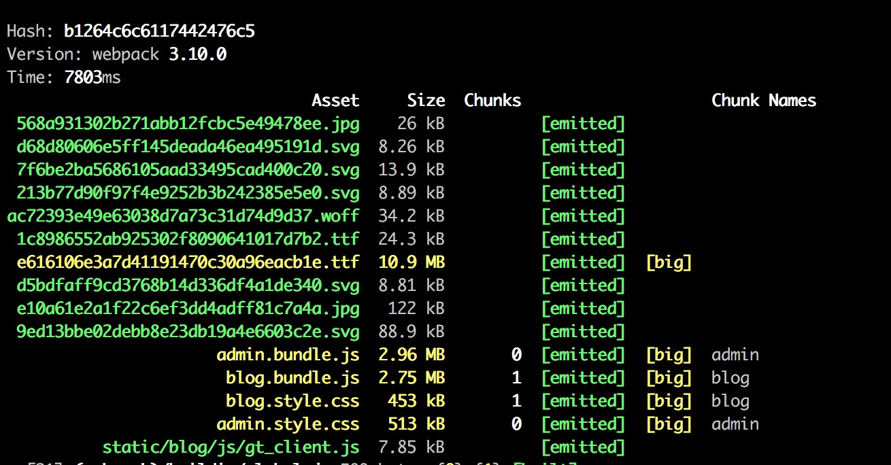
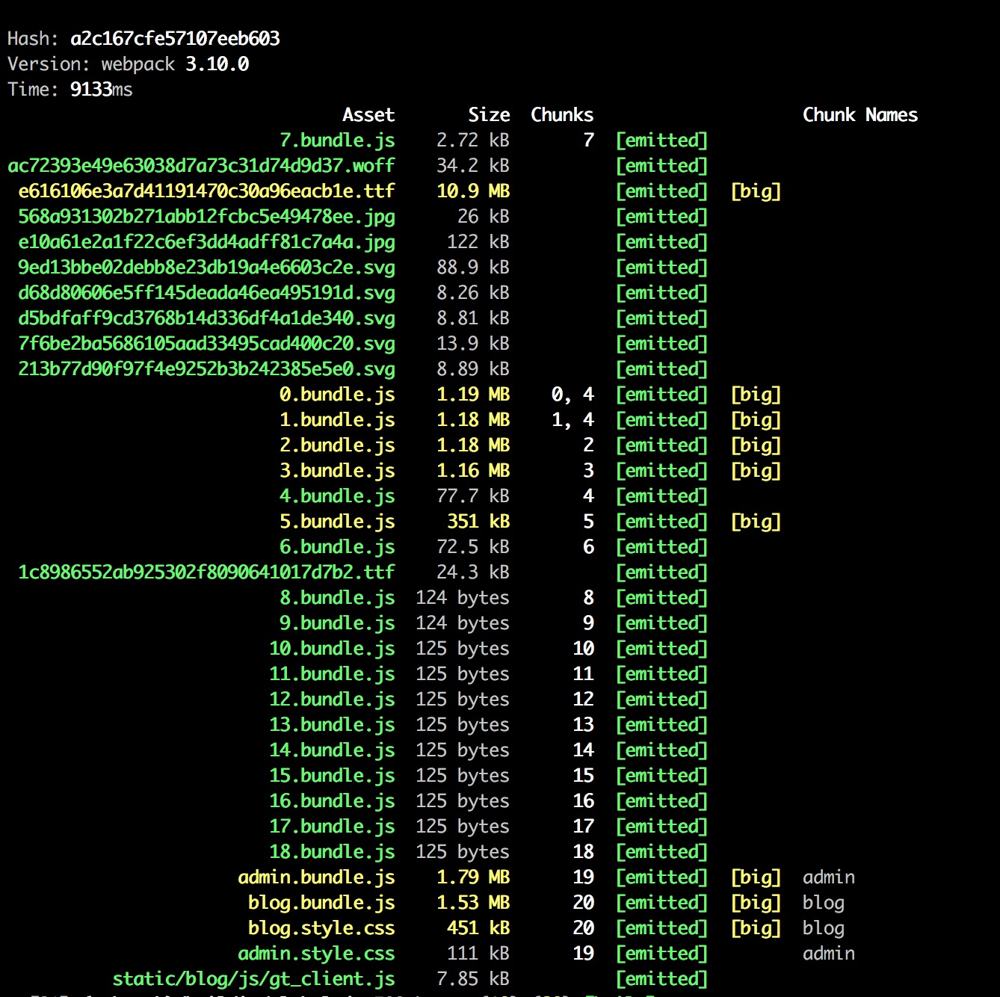
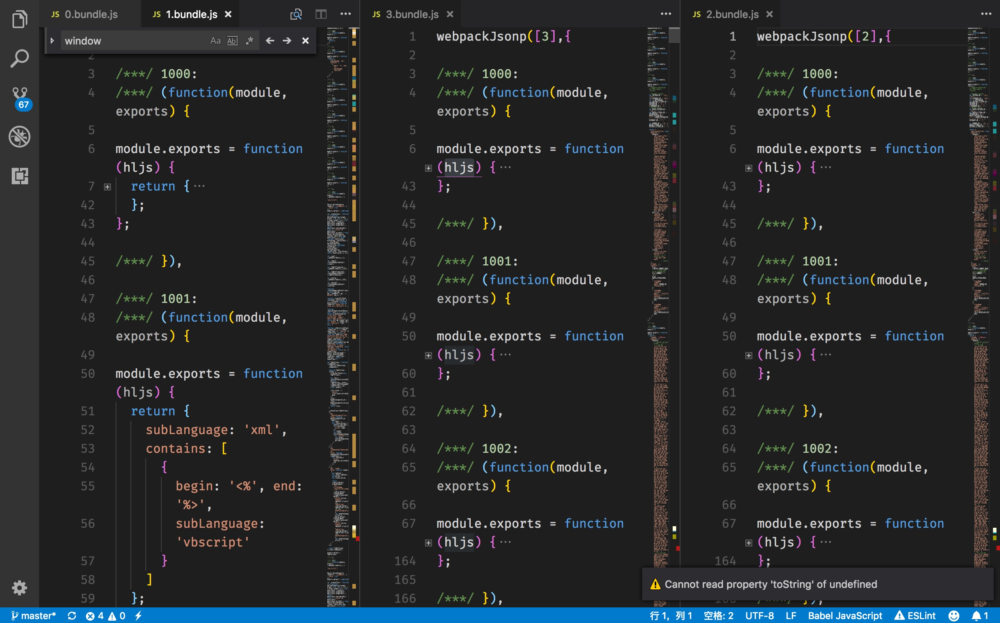
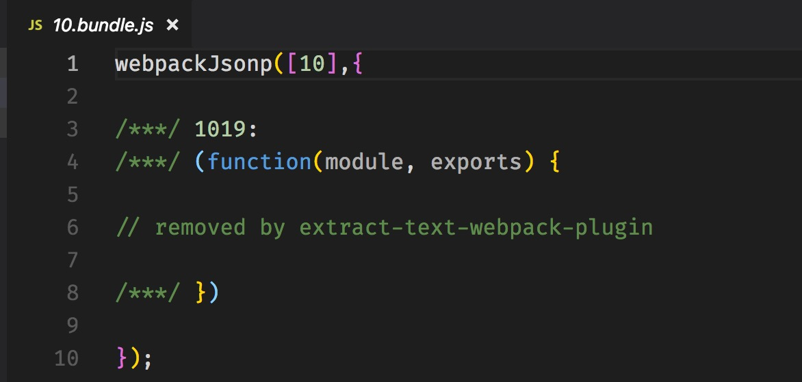
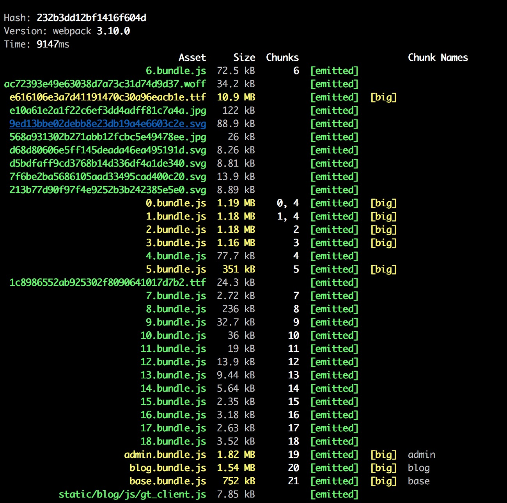
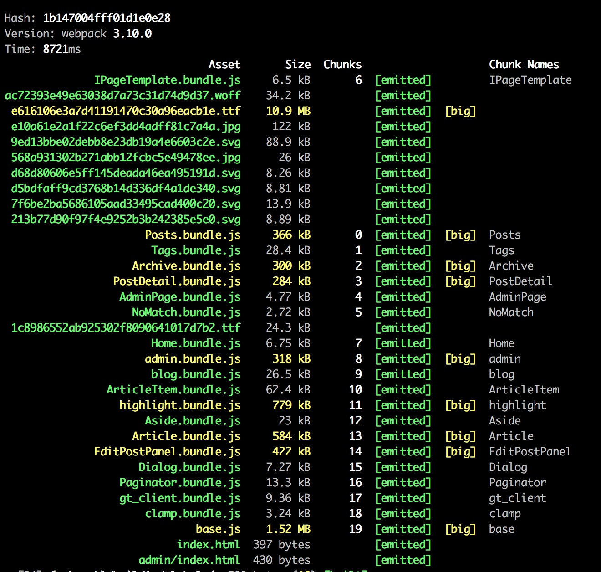
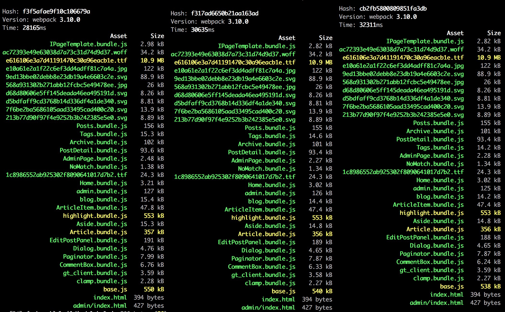

## 前言

本文主要记录使用 webpack 优化我的个人博客的过程，算是对 webpack 实践部分的补充。我的博客是典型的单页面应用，主要技术栈是React全家桶+Koa+Mongoose+GraphQL。在没有任何优化之前，我打包出来的文件有以下这些：



可以看到在代码组织上，我把所有的JS代码和样式都放到单独的一个文件里面，这显然是不可行的。需要想方设法缩小打包出来的文件体积，思路是将样式和对应的组件关联起来，同时异步加载我们的组件，做到按需加载。

## 按需加载

这里我使用了react-loadable来异步加载我们的页面。react-loadable 主要还是利用了 webpack 提供的 import 全局函数来动态加载组件。webpack 文档中也提到了在调用 import 的地方会被作为新分离出来的 chunk 的起点，即需要异步加载的模块和它引用的所有子模块，会分离到一个单独的 chunk 中。import() 函数会返回一个 Promise 对象。基本使用方法如下：

```javascript
let LoadableHome = Loadable({
  loader: () => import('./containers/Home'),
  loading: Loading // react-loadable会给Loading组件传入loading，error等props，loading表示异步加载的组件是否正在加载，error表示加载过程中遇到的错误
}) // 返回一个高阶组件，给该高阶组件传入的props最终会传递给异步加载的组件作为其props
```

在将组件及其样式关联同时异步加载组件之后，我们打包出来的结果如下：



可以看到我们异步加载组件的效果，多出了很多新的bundle，其中也发现了一些问题：

1. 生成0～3.bundle.js依然很大，打开生成的bundle我们可以发现这些bundle都依赖了highlight.js，并且把这个第三方库重复包含多次：



这部分需要通过下一步的提取公共代码来解决。

2. 生成8～18.bundle.js大小几乎完全一样，这部分文件是将样式关联到对应的组件时抽离出来用于加载CSS的bundle文件。打开这些文件我们会发现里面的内容都是这样子的：



可以看到这是我们在打包时引入的 `extract-text-webpack-plugin` 插件抽离成CSS文件的缘故。这就涉及到我们是要把 CSS 单独抽离成CSS文件进行加载（有利于缓存CSS资源）还是说以 'CSS-in-JS' 的形式存在（在组件层级上按需加载CSS资源）的问题了。这里的决定是将CSS通过后者这种方式进行加载，这样可以避免页面加载没有用到的 CSS 资源，提升性能。于是把我们引入的 `extract-text-webpack-plugin` 插件从 webpack 配置文件中删去，同时需要在组件中引入组件所需的CSS模块，手动将添加样式到我们的页面中去。代码示例：

```javascript
import styles from 'path/to/my/css/or/scss'
export default class MyComponent extends React.Component {
  componentWillMount () {
    for (let ss of styles) {
      let [styleId, style] = ss
      if (!document.getElementById(`style-${styleId}`)) {
        let styleEle = document.createElement('style')
        styleEle.id = `style-${styleId}`
        styleEle.innerHTML = style
        document.head.appendChild(styleEle)
      }
    }
  }
}
```

重新打包我们的应用，结果如下：



## 提取公共代码

我们的应用中会使用一些第三方库来加快开发效率，从上面打包的结果来看，有一些bundle体积依然过大，显然这是不利于首屏渲染的。可以去分析模块的依赖关系，将一些复用的模块比如基础库单独抽离出来作为独立的bundle，同时因为我们基本不会对第三方库进行修改，单独抽离出来也可以利用浏览器缓存或者CDN缓存提升加载速度，同时也减轻服务器负担。

由于我的应用是基于React技术栈的，很显然可以把react作为基础库抽离出来作为独立的bundle。同时还存在一些体积较大的第三方模块（比如上面提到的highlight.js）只是被部分页面引用而非全部页面，可以在引用这些模块的组件中借助webpack的import函数异步加载这些模块，然后在模块加载完成往下执行正常的业务逻辑，本质上和react-loadable是相同的。

提取基础库的配置也很简单，这里需要用到 webpack （webpack版本4以前）内置的 CommonsChunkPlugin 插件，同时为了将生成的基础库 bundle 通过 script 标签自动插入到最终打包出来的 html 页面，这里还需要用到 `html-webpack-plugin` 插件。配置示例：

```javascript
{
  entry: {
    'base': [
      'react',
      'react-dom'
    ],
    'blog': [
      path.resolve(__dirname, '../client/blog/index.js')
    ]
  },
  ...
  plugins: [
    new webpack.optimize.CommonsChunkPlugin({
      name: 'base',
      filename: 'base.js'
    }),
    new HTMLWebpackPlugin({
      template: path.resolve(__dirname, '../static/index.html'),
      filename: path.resolve(__dirname, '../build/index.html'),
      chunks: ['base', 'blog'],
      minify
    })
  ]
}
```

这样我们就把基础库给提取出来了，接下来就是处理那些被部分页面多次复用的模块。可以通过 react-loadable 库进行按需加载。另外对于部分没有遵循 UMD 等模块规范，仅仅是向全局暴露接口的模块，如果不是基础库范畴，也可以通过 react-loadable 进行异步加载，在加载完成后的回调中直接使用暴露出来的全局变量。通过以上这些步骤，我们打包出来的bundle结果如下：



除了基础库代码文件和字体文件体积依然较大之外，之前其他体积较大的bundle体积也明显缩小。

## 代码压缩

由于我们打包出来的资源基本上是JS文件，可以使用官方推荐的 `uglifyjs-webpack-plugin` 插件进一步缩小我们文件的体积，配置也很简单，代码如下：

```javascript
plugins: [
  new UglifyJSPlugin({
    test: /\.js$/,
    uglifyOptions: {
      output: {
        beautify: false,
        comments: false
      },
      compress: {
        drop_console: true,
        collapse_vars: true,
        reduce_vars: true
      }
    }
  })
]
```

除此之外，还可以开启 Tree Shaking，帮助我们自动移除项目中不会用到的代码。该特性的使用依赖于我们在项目中使用的 ES6 import/export 语法来分析模块依赖关系，进而将没有用到的代码从打包后的结果中移除。这就需要在转化 ES6 代码时保留模块的导入导出语法，所以需要更改 babel 配置文件使得 babel 在转化时保留该语法。具体配置如下：

```javascript
// .babelrc中env preset添加modules: false配置项
{
  "presets": [
    ["env", {
      "modules": false
    }]
  ]
}
```

然后后续工作交给 `uglifyjs-webpack-plugin` 插件，对文件进行压缩即可。对于我们在项目中使用的第三方库，很多都是基于 CommonJS 模块规范编写的，在开启 Tree Shaking 时仅会对提供 ES6 模块规范的第三方库进行分析，幸运的是一些第三方库也会提供遵循 ES6 模块规范的对应的版本，社区也有不成文的规定，第三方库遵循 ES6 模块规范对应的版本通常会在package.json文件中通过 'jsnext:main' 来指定入口。所以还需要配置 webpack 在分析模块时添加该入口，更改 webpack 配置文件如下：

```javascript
resolve: {
  mainFields: ['jsnext:main', 'browser', 'main']
}
```

还有一个优化选项就是开启 Scope Hoisting，它的作用是可以减少webpack打包结果中不必要的函数声明，尽可能地将模块合并到一个函数中，这样做的前提是不能造成代码冗余，所以 webpack 仅会对那些被引用了一次的模块进行合并。同样 Scope Hoisting 也只能处理使用了 ES6 import/export 语法的模块，所以也需要在 webpack 配置文件中添加上面的 resolve.mainFields 配置项。开启 Scope Hoisting 也很简单，配置代码如下：

```javascript
let ModuleConcatenationPlugin = require('webpack/lib/optimize/ModuleConcatenationPlugin')
module.exports = {
  ...
  plugins: [
    new ModuleConcatenationPlugin()
  ]
}
```

经过上面代码压缩的这三个步骤（使用 `uglifyjs-webpack-plugin` 插件、开启 Tree Shaking 和 Scope Hoisting），我们最终打包出来的结果依次如下：



可以看到，`uglifyjs-webpack-plugin` 插件可以大幅缩小输出的文件的体积，而开启 Tree Shaking 和 Scope Hoisting 之后优化的程度不是很明显。

## 总结

本文对 webpack 在实际项目中的使用做了记录，主要是从三个方面来提升打包之后页面的加载性能：

1. 按需加载，减小页面初始加载的bundle的体积；
2. 提取公共代码，便于客户端缓存，减少不必要的请求；
3. 代码压缩，进一步缩小输出文件的体积；

除了优化页面加载性能，webpack 还可以做其他很多事情，比如使用多进程构建工具提升构建性能，提高开发效率；使用可视化分析工具比如 webpack-bundle-analyzer，可以很直观地分析得出我们的应用存在的一些优化点。


