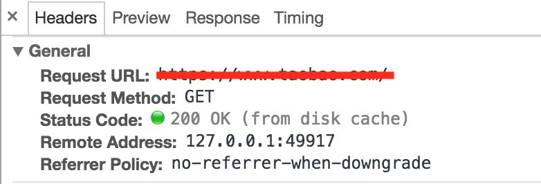

## 使用缓存的好处

缓存广泛存在于我们的日常上网过程中。使用缓存主要有几个好处：

一是能够减轻服务器端的访问压力；

二是使用本地缓存能够加快页面的载入速度，提升用户体验。

## web缓存分类

在了解如何使用缓存来优化我们的web应用之前，我们先来看看web缓存具体有哪些分类：

### 浏览器缓存

浏览器可以将一些比较消耗带宽而且几乎不会变更的静态资源缓存在本地，当用户需要再次使用这部分资源（比如用户在点击浏览器中的页面前进或后退按钮等）时，就可以直接从浏览器缓存中加载，而不需要再向服务器发起请求。

### 服务器端缓存

典型代表就是反向代理服务器缓存，反向代理服务器大多数时候就是在分担服务器端的访问压力，能尽量减少向源服务器发送请求就尽量减少，能尽可能地利用缓存下来的资源就尽可能地利用。一些大型站点会使用CDN，目的是为了让用户就近访问，加快页面的载入速度，而在每个CDN节点同样也会缓存用户访问过的资源，因此也属于服务器端缓存的范畴。

## 缓存手段

要实现浏览器和服务器对用户重复访问的资源进行缓存控制，主要有两种途径：

一种是通过设置 `<meta>` 标签来控制：

```
<meta http-equiv="Pragma" content="no-cache">
<meta http-equiv="Expires" content="-1">
```

注意上面两条指令的作用是不允许浏览器缓存当前页面以及页面上引用的资源，强制浏览器每次请求当前页面时都需要从服务器端获取最新版本。这种方式仅对部分浏览器有效，而且不影响代理服务器对该页面的缓存控制，原因是因为代理服务器并不会去解析页面上的内容。

另外一种应用更加广泛的方法就是通过 http 协议的头部字段进行缓存的控制。而通过 http 头部字段进行控制又可以从两个角度来控制缓存：分别是新鲜度（对应 `Cache-Control` 和 `Expires`）和校验值(对应 `Last-Modified` 和 `Etag`)。其实缓存控制就是在关注这样两个问题：一方面是可以缓存多长时间（新鲜度），另一方面则是如何判断缓存失效（校验）。

### Cache-Control/Expires

`Cache-Control` / `Expires` 这一组头部字段都可以用来指定缓存的有效期，区别在于前者除了可以指定缓存有效期（通过设置max-age参数，该参数值和Expires具体含义还不相同，前者指定缓存时长，而后者指定缓存过期的时间点）之外，还可以实现更加精细的缓存控制功能；而后者只能单一地设置缓存的有效期。

Cache-Control 是一个通用首部，并且在请求头和响应头使用的参数还略微有些差异。下面就具体介绍一下 Cache-Control 可以设置的参数都有哪些以及它们所代表的含义（此处仅介绍出现在服务器端响应中的 Cache-Control 可能会用到的参数）。

- `max-age=<num>`: 前面提到过了，这里不再赘述。单位：秒
- `s-max-age=<num>`: 作用和 max-age 类似，区别在于该参数仅对提供共享缓存的公共代理服务器起作用
- `no-store`：不允许客户端和缓存服务器对响应进行缓存，意味着每次都会重新向源服务器发起请求（注意不是条件请求）
- `no-cache`：应用这个值时，客户端和缓存服务器在使用缓存资源之前需要向源服务器发起**条件请求**确认，类似于max-age=0，注意此时浏览器和缓存服务器是可以缓存响应的
- `public`：此参数是对缓存服务器起作用的，表示允许向多个不同的用户提供同一份缓存（共享缓存）
- `private`：与`public`刚好相反，表示当前缓存的内容仅能对当前用户提供

Cache-Control 首部的值可以由多个参数组合而成，参数之间使用逗号隔开。

`Expires` 首部用于指定缓存失效的时刻，时间是以服务器上的时间为准。

### Last-Modified/Etag

服务器可以通过Last-Modified响应首部来指明当前访问资源最近一次修改是在什么时候，客户端在发送请求校验资源是否发生修改时，可以通过If-Modified-Since请求首部向服务器端确认资源在给定时间点之后是否发生更改，服务器可以根据比对资源的最近一次修改时间和If-Modified-Since首部指定的时间来决定返回304状态码还是返回新的资源。

使用Last-Modified/If-Modified-Since比对文件修改时间的这套机制存在的问题就是：

1. 因为Last-Modified指定的修改时间是精确到秒级的，如果服务器上的文件在一秒内发生多次更改，单纯依靠文件修改时间就检测不到文件已经发生变化

2. 如果文件在某个时间段内发生多次更改，但是前后文件内容并没有发生变化，这时依靠文件修改时间去判断文件已经发生修改也不合适

而通过Etag响应首部就能够解决上面提到的问题。通过对当前文件内容计算生成一个唯一标识，通过比对标识是否相同来判断文件内容是否发生变化。相比于比较文件修改时间，这种方式更加有效。客户端在发送条件请求时，会包含 `If-None-Match` 请求首部，来判断文件内容是否发生变化。


### Pragma

除了可以使用上面提到的这些首部来控制缓存之外，另外还有一个古老的响应首部就是 `Pragma`。Pragma 首部的值只有一个可选值就是 `no-cache` ，含义和 Cache-Control: no-cache 是一样的。但是 Pragma 优先级要高于 Cache-Control，而Cache-Control则又比Expires首部具有更高的优先级。

## 浏览器行为

除了可以通过 http 首部来控制缓存之外，在浏览器中不同的操作行为同样也会影响浏览器是否使用缓存。

当用户点击前进或后退按钮，无论服务器响应的Cache-Control是什么值（`no-store`除外），浏览器都会直接使用硬盘中缓存的内容。

在**Cache-Control/Expires指定的有效期内**如果用户输入URL地址之后回车（包括点击页面的刷新按钮或者 `F5`），此时浏览器会直接使用硬盘中的缓存内容（如下图），而不会向服务器发起请求。而此时如果缓存期限已过，而之前服务器响应中包含 Last-Modified/Etag 首部（一般服务器返回的响应都会包含这两个首部，不需要额外的配置），则会向服务器发起条件请求，如果服务器端内容没有发生更改，则会响应 `304` 状态码，提示浏览器缓存有效。



当点击 `Ctrl+F5` 时，即使缓存的资源依然有效（仍然在 Cache-Control 首部包含的 max-age 参数指定的期限之内），浏览器也会向服务器发起请求（注意此时的请求就不是条件请求了，而是强制从服务器获取最新的内容）。

## 结论

文章中我们主要探讨了如何通过 http 首部来控制浏览器端缓存，主要可以概括为以下几点：

1. Cache-Control 可以精细地控制缓存，但是需要注意的一点是，它是在 **HTTP/1.1** 中才出现的，如果需要兼容旧版本，在指定缓存时长时可以和 Expires 首部一起搭配使用，如果要指定为 no-cache 则可以和 Pragma 首部一起使用

2. 不同的浏览器操作行为同样会影响浏览器是否使用本地缓存，有些行为（比如点击前进后退按钮）会直接从浏览器缓存中返回内容，有些行为（比如当缓存过期时点击刷新按钮等）则会导致浏览器发送条件请求确认资源是否更新

3. 优先使用Etag/If-None-Match来校验资源是否有效